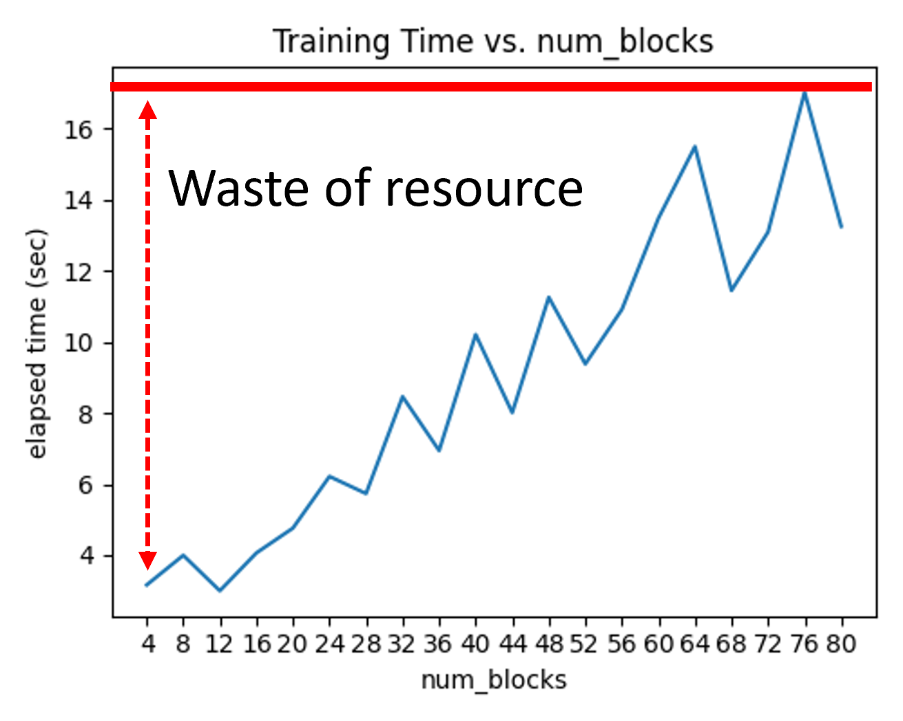

# Efficient Training of Large-Scale Configurations (Slurm + Ray)

## Motivation

Training many independent configurations on an HPC cluster (Slurm-based) can become inefficient when:
- Numerous training configurations
- Training times vary across configurations

Goal:
- Minimize idle GPU time
- Avoid unnecessary queue priority penalties
- Reduce job submission overhead
- Improve overall resource efficiency

---
## Demo Scenario
- 20 configurations
- 1 GPU per training
- Longest training time among configurations ≈ 17s
- Training:
    - Simple classfication model
        - Network: Resnet with varying depth
        - Resblock: 4 to 80 with step of 4

## Problems with pure Slurm Approach

### Option 1 — Submit 20 Separate Jobs

```bash
sbatch train_1.sh # 4 Resblocks
...
sbatch train_20.sh # 80 Resblocks
```

Issues:

- Manual submission overhead
- Hard to scale to 100+ jobs
- Monitoring becomes cumbersome

### Option 2 — Slurm Array Jobs
A slurm script with an array of 20 jobs:
```bash
...
#SBATCH --array=0-19
#SBATCH --time=00:00:20  # Must set to longest job time
...
```

Limitations:
- Static time allocation
- Must set --time equal to longest training
- Short jobs finish early → GPUs idle
- Longer requested time → lower scheduling priority
- Complex shell scripting for dynamic behavior

Result:
- Resource waste
- Lower cluster efficiency
- Reduced job priority



## Solution: Slurm + Ray

### Core Idea
- Submit one Slurm job
- Request multiple GPUs
- Use Ray inside the job for dynamic scheduling

### Execution Model
``` arduino
Slurm Job
 ├── Request: N GPUs
 ├── world_size = N
 └── Ray runtime
       ├── Train config A
       ├── Train config B
       ├── ...
       └── Dynamically scheduled configs
```


Ray handles:

- GPU assignment
- Task scheduling
- Parallel execution
- Dynamic load balancing

### Why Ray Improves Efficiency
1. Dynamic GPU Allocation
    - Automatically assigns available GPUs
    - No need to pre-split configurations
    - No static mapping
2. Continuous GPU Utilization
    - If longest job = 17s:
        - When one configuration finishes,
        - Ray immediately schedules the next
        - GPUs remain occupied
        - Minimal idle time.
3. Single Slurm Submission
    - Instead of 20–100 sbatch calls:
        ```python
        ray.fit(...)
        ```
        Only one Slurm job is required.

## Comparison

| Metric | Slurm (array job, n = 20) | Slurm + Ray (single job) | Note |
| --- | --- | --- | --- |
| Requested time per job | 17 s | 200 s |  |
| Total requested time | 20 * 17 s = 340 s | 200 s | $\approx$ 58% lower |
| Requested # GPU per job | 1 | 4 |  |
| Total # GPU | 20 | 4 | $\approx$ 20% lower |
| Total running time | 180 s | 180 s |  |
| Wasted blocked time | 160 s | 20 s | $\approx$ 12% lower |
| Wasted GPU time | 1 * 160 s = 160 s | 4 * 20 s = 80 s | $\approx$ 50% lower |


## Take-Home Message
Using Slurm + Ray enables:
- Better GPU utilization
- Reduced wall-clock training time
- Higher job scheduling priority
- Lower project cost
- Clean Python-based orchestration

Efficient experiment management becomes critical when scaling hyperparameter sweeps or ablation studies.

### Recommended Use Cases
- Hyperparameter optimization
- Large ablation studies
- Scan-specific training experiments
- Research-scale distributed experimentation


## Running the Demo
1. Clone the repo
```bash
git clone git@github.com:JinhoKim46/Distributed-training-for-multiple-configurations.git
```
2. Install conda environment
```bash
conda create -n ray python=3.13
```
3. Install dependencies
```bash
pip install torch==2.7.1 torchvision==0.22.1 torchaudio==2.7.1 --index-url https://download.pytorch.org/whl/cu118
```
```bash
pip install -r requirements.txt
```
4. Run the script
```bash
python simple_classification_Ray.py
```